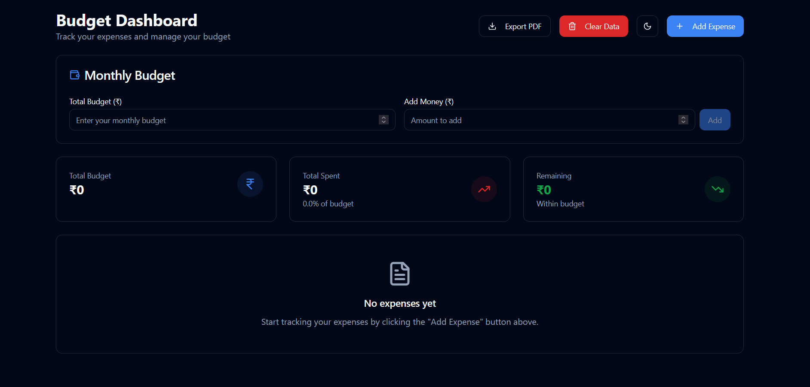
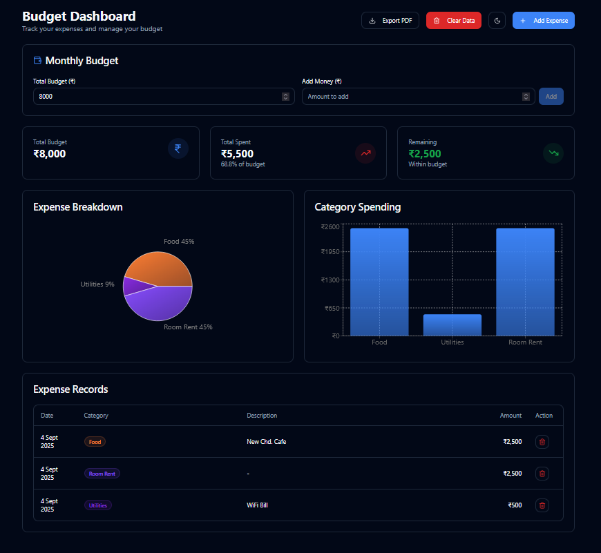
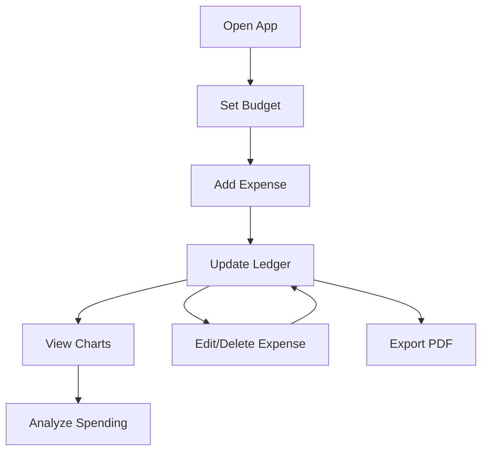
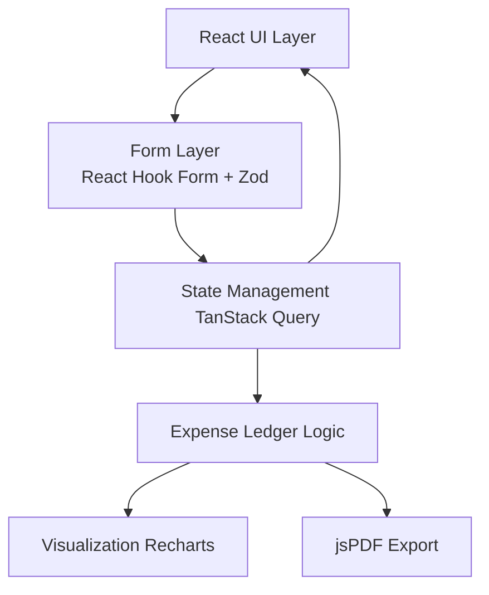

# 🚀 Dash Budget

A **modern, responsive, and production-ready budget dashboard** built with **React + Vite**. Dash Budget helps users **track expenses, manage budgets, and visualize financial data** with a clean UI and powerful analytics.

> ⚡ Built for performance, scalability, and real-world usability.

---


## 📸 Preview

### 🏠 Dashboard


### 🧾 Expense Ledger



---

## ✨ Features

* 💰 **Budget Tracking** – Set and monitor total budget & remaining balance
* 🧾 **Expense Ledger** – Add, edit, and delete transactions seamlessly
* 📊 **Interactive Charts** – Visualize spending patterns using Recharts
* ⚡ **Real-time UI Updates** – Efficient state syncing with TanStack Query
* 🌗 **Dark / Light Mode** – Smooth theme switching
* 📱 **Fully Responsive** – Works across desktop, tablet, and mobile
* 🧩 **Accessible UI Components** – Built with Radix UI
* 🧠 **Form Validation** – Powered by React Hook Form + Zod
* 📄 **PDF Export** – Generate downloadable financial reports

---

## 🔄 User Flow



---

## 🧩 System Architecture



---

## ⚙️ Tech Stack

### 🖥️ Frontend

* React
* React Router
* Vite

### 🎨 Styling

* Tailwind CSS
* Tailwind Animate
* Class Variance Authority (CVA)

### 🧩 UI & Components

* Radix UI
* Lucide React (icons)

### 🧠 Logic & State

* TanStack Query
* Custom Hooks

### 📊 Data Visualization

* Recharts

### 📝 Forms & Validation

* React Hook Form
* Zod

### 📅 Utilities

* date-fns
* React Day Picker

### 📄 Export

* jsPDF

---

## 🏗️ Project Structure

```
dash-budget/
├── src/
│   ├── components/       # Reusable UI components
│   ├── pages/            # Route-level pages
│   ├── hooks/            # Custom hooks
│   ├── utils/            # Helper functions
│   ├── styles/           # Tailwind & global styles
│   ├── App.tsx           # Root component
│   ├── main.tsx          # Entry point
├── public/               # Static assets
├── package.json
├── vite.config.ts
├── tailwind.config.js
├── tsconfig.json
└── README.md
```

---

## 🚀 Getting Started

### 📌 Prerequisites

* Node.js (v18+)
* npm / yarn

### 📥 Installation

```bash
git clone https://github.com/panda-rajsekhar/Budget-Dash.git
cd Budget-Dash
npm install
```

### ▶️ Run Development Server

```bash
npm run dev
```

App runs at:
👉 [http://localhost:5173](http://localhost:5173)

---

## 📜 Available Scripts

* `npm run dev` → Start dev server
* `npm run build` → Production build
* `npm run preview` → Preview build
* `npm run lint` → Lint code

---

## 📊 How It Works

1. User sets a **total budget**
2. Expenses are added via validated forms
3. Data is stored and synced using **TanStack Query**
4. Ledger updates in real-time
5. Charts dynamically reflect spending patterns
6. Users can export reports as PDF

---

## 🛣️ Roadmap / Future Improvements

* 🔐 Authentication (user accounts)
* ☁️ Cloud sync (Firebase / Supabase)
* 📈 Advanced analytics (ML-based insights)
* 💸 Category-wise budgeting
* 📱 PWA support

---

## 🤝 Contributing

Contributions are welcome!

```bash
# Fork the repo
git checkout -b feature/your-feature
# Make changes
git commit -m "Add feature"
git push origin feature/your-feature
```

Then open a Pull Request 🚀

---

## 🙌 Acknowledgments

* Vite – lightning fast builds
* Radix UI – accessible components
* Tailwind CSS – utility-first styling
* Recharts – data visualization

---

## 👨‍💻 Author

**Rajsekhar Panda**

---

## ⭐ Show Your Support

If you like this project, consider giving it a ⭐ on GitHub!

---

## 📦 Output

This folder contains the expected UI output of the application.

📁 Location:

```
Output/
├── dashboard.png   # Main dashboard view
├── ledger.png      # Expense ledger
├── charts.png      # Data visualization
```

🔗 GitHub Directory:
[https://github.com/panda-rajsekhar/Budget-Dash/tree/main/Output](https://github.com/panda-rajsekhar/Budget-Dash/tree/main/Output)

These images represent how the application looks and behaves after running locally.
I chose this approach because React Query caching was overkill here
